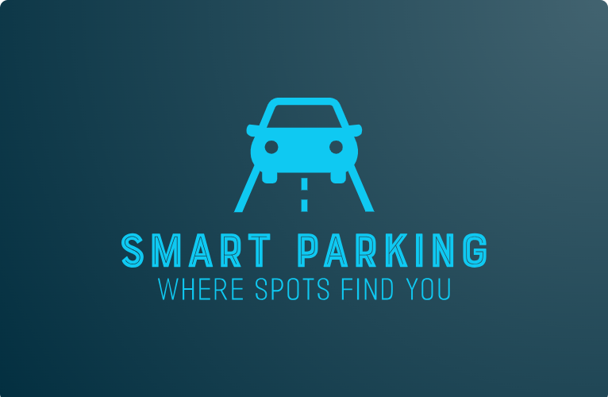

  <h1>Welcome to Smart-Parking 👋🚗</h1>
  <h3>Website for Smart-Parking Project Application : <a href="https://typhoon-30042004.github.io/SMART-PARKING/">Click Here!</a></h3>

</a>

## 📌 Repository

Smart-Parking is a complete parking management system applying smart solutions for short time rental of empty spaces (Parking, Apartment, Office Spaces etc). This website is designed to helps users find safe, affordable and low cost parking to get rest easy while on a hustle.

This is a most prominent trouble especially in metropolitan and tier-1 cities where vehicles are used at maximum potential in their daily lives. With no space to park their vehicles, it's evitable to have seen or prone to careless parking on roads or unauthorized places which disrupts the smooth flow of passages for society.

## ✔ Features

- It allows users to get suggestions on parking locations (renders on map with information of price and availability using area / pincode) based on their schedules one plans to attend. While searching, it also shows with events nearby.
- User can dynamically track empty parking spots to park their vehicles in a lot at the nearest slot available and releases slots as car surpasses the location.
- It allows to book/reserve the parking slots in prior to reaching the authorized parking lot.
- Opens up the gate/handle of parking lot for vehicles to enter the space using sensing techniques.
- While exiting, it automatically checks the complete history of the car using vehicle registration number (owner authority, licence checking, pending challans).
- With vehicle registration number and color of vehicle, user can easily track their vehicle location in a hump through their own device.
- Using sensor, it updates parking lot metrics which in turn is sent to database for users to view the details.
- If vehicle is parked in No parking zone, an user can detect vehicle owner details and email that the vehicle has been taken by RTO.
- Users can also share the best spots via posts for the community.

## 🔑 Tech Stacks

Skills : Machine Learning, Deep Learning, Computer Vision, Django, IoT

Programming Languages : Python, HTML, CSS, JavaScript

When raising an issue, do make sure to mention the kind of feature, feature title, short description of the feature and how would you expect it to work. As a good practice, always link the issue number with pull request. (#issue number : Give this details when you raise a PR).

If you want to work on this unique project and share it with the world, you can do that here.
Go through the contributing guidelines . If any changes or improvements are needed , please go to the issues tab and raise your concern there.

Subsequently, also go through the GitHub documentation on [creating a pull request](https://help.github.com/en/github/collaborating-with-issues-and-pull-requests/creating-a-pull-request).
